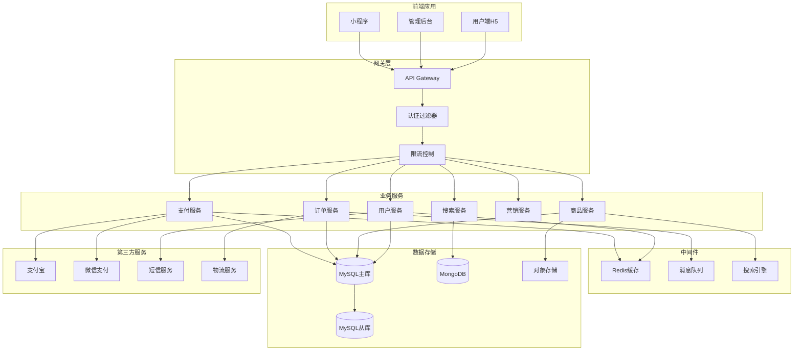
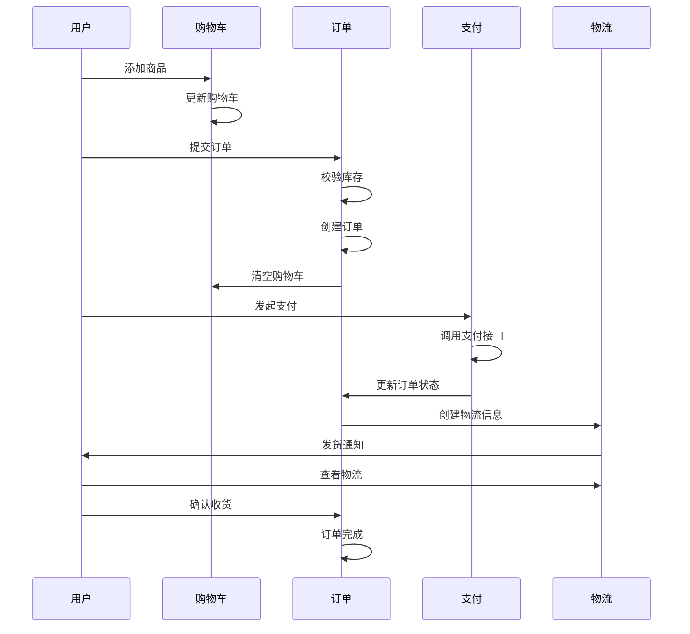

# 🛒 fork-mall4j - 电商商城系统


## 📖 项目简介

fork-mall4j是一个基于Spring Boot + Vue的电商商城系统,提供完整的B2C商城解决方案,包括商品管理、订单管理、用户管理、营销活动等功能模块。

## 📦 项目来源

- **原项目**: [gz-yami/mall4j](https://github.com/gz-yami/mall4j)
- **原作者**: gz-yami
- **开源协议**: GNU Affero General Public License v3.0 (AGPL-3.0)
- **Fork时间**: 2024年

## 🔧 二次开发内容

本项目为原项目的学习研究版本,主要用于:
- 学习电商系统的架构设计
- 研究微服务架构的实现方法
- 了解支付、订单、库存等核心业务逻辑

## 📖 项目简介

fork-mall4j是一个基于Spring Boot + Vue的电商商城系统,提供完整的B2C商城解决方案,包括商品管理、订单管理、用户管理、营销活动等功能模块。

## 🏗️ 系统架构



## 🚀 快速开始

### 环境要求

- JDK 17+
- Node.js 16+
- MySQL 8.0+
- Redis 6.0+
- RabbitMQ 3.x

### 安装步骤

```bash
# 1. 克隆项目
git clone https://github.com/yourusername/fork-mall4j.git

# 2. 后端配置
cd mall4j-admin
# 修改 src/main/resources/application.yml
spring:
  datasource:
    url: jdbc:mysql://localhost:3306/mall4j
    username: root
    password: your_password

# 3. 初始化数据库
mysql -u root -p < db/schema.sql

# 4. 启动后端
mvn spring-boot:run

# 5. 前端配置
cd ../mall4j-vue
npm install

# 6. 启动前端
npm run dev

# 7. 访问应用
# 后台管理: http://localhost:8080/admin
# 用户端: http://localhost:3000
```

## 🛠️ 技术栈

### 后端技术

| 技术 | 版本 | 说明 |
|------|------|------|
| Spring Boot | 3.x | 应用框架 |
| Spring Security | 3.x | 安全框架 |
| MyBatis-Plus | 3.5+ | ORM框架 |
| MySQL | 8.0+ | 关系数据库 |
| Redis | 6.0+ | 缓存数据库 |
| RabbitMQ | 3.x | 消息队列 |
| ElasticSearch | 8.x | 搜索引擎 |

### 前端技术

| 技术 | 版本 | 说明 |
|------|------|------|
| Vue.js | 3.x | 前端框架 |
| Element Plus | 2.x | UI组件库 |
| Pinia | 2.x | 状态管理 |
| Axios | - | HTTP客户端 |

## 📁 项目结构

```
fork-mall4j/
├── mall4j-admin/                # 后台管理API
│   ├── src/main/java/
│   │   └── com/yami/shop/admin/
│   │       ├── controller/      # 控制器
│   │       ├── service/         # 服务层
│   │       ├── dao/             # 数据访问层
│   │       └── AdminApplication.java
│   └── pom.xml
├── mall4j-api/                  # 用户端API
│   ├── src/main/java/
│   │   └── com/yami/shop/api/
│   │       ├── controller/      # 控制器
│   │       ├── service/         # 服务层
│   │       ├── dao/             # 数据访问层
│   │       └── ApiApplication.java
│   └── pom.xml
├── mall4j-common/               # 公共模块
│   ├── src/main/java/
│   │   └── com/yami/shop/common/
│   │       ├── core/            # 核心类
│   │       ├── bean/            # 实体类
│   │       ├── util/            # 工具类
│   │       └── config/          # 配置类
│   └── pom.xml
├── mall4j-security/             # 安全模块
│   ├── src/main/java/
│   │   └── com/yami/shop/security/
│   │       ├── config/          # 安全配置
│   │       ├── handler/         # 处理器
│   │       └── filter/          # 过滤器
│   └── pom.xml
├── mall4j-vue/                  # 后台管理前端
│   ├── src/
│   │   ├── views/              # 页面
│   │   ├── components/         # 组件
│   │   ├── router/             # 路由
│   │   ├── store/              # 状态管理
│   │   └── api/                # API接口
│   └── package.json
└── db/                          # 数据库脚本
    ├── schema.sql              # 表结构
    └── data.sql                # 初始数据
```

## 💡 核心示例

### 商品管理

```java
@RestController
@RequestMapping("/admin/prod")
public class ProdController {
    
    @Autowired
    private ProdService prodService;
    
    @GetMapping("/page")
    public Result<IPage<Prod>> page(
        @RequestParam(defaultValue = "1") Integer current,
        @RequestParam(defaultValue = "10") Integer size,
        @RequestParam(required = false) String prodName
    ) {
        IPage<Prod> page = prodService.page(
            new Page<>(current, size),
            new LambdaQueryWrapper<Prod>()
                .like(StrUtil.isNotBlank(prodName), Prod::getProdName, prodName)
                .orderByDesc(Prod::getCreateTime)
        );
        return Result.success(page);
    }
    
    @PostMapping
    public Result<Void> save(@RequestBody Prod prod) {
        prodService.saveProd(prod);
        return Result.success();
    }
    
    @PutMapping
    public Result<Void> update(@RequestBody Prod prod) {
        prodService.updateProd(prod);
        return Result.success();
    }
    
    @DeleteMapping("/{id}")
    public Result<Void> delete(@PathVariable Long id) {
        prodService.deleteProd(id);
        return Result.success();
    }
}
```

### 订单管理

```java
@Service
public class OrderService {
    
    @Autowired
    private OrderMapper orderMapper;
    
    @Autowired
    private ProductService productService;
    
    @Autowired
    private CartService cartService;
    
    @Transactional(rollbackFor = Exception.class)
    public Order submitOrder(OrderDTO orderDTO) {
        // 1. 校验库存
        for (OrderItemDTO item : orderDTO.getItems()) {
            Product product = productService.getById(item.getProdId());
            if (product.getStocks() < item.getCount()) {
                throw new BusinessException("商品库存不足");
            }
        }
        
        // 2. 创建订单
        Order order = new Order();
        order.setOrderNumber(generateOrderNumber());
        order.setUserId(UserContext.getUserId());
        order.setTotalAmount(calculateTotalAmount(orderDTO.getItems()));
        order.setStatus(OrderStatus.SUBMIT);
        orderMapper.insert(order);
        
        // 3. 创建订单项
        for (OrderItemDTO item : orderDTO.getItems()) {
            OrderItem orderItem = new OrderItem();
            orderItem.setOrderId(order.getId());
            orderItem.setProdId(item.getProdId());
            orderItem.setCount(item.getCount());
            orderItem.setPrice(item.getPrice());
            orderMapper.insertOrderItem(orderItem);
            
            // 4. 扣减库存
            productService.reduceStock(item.getProdId(), item.getCount());
        }
        
        // 5. 清空购物车
        cartService.clearCart(UserContext.getUserId());
        
        // 6. 发送订单创建消息
        rabbitTemplate.convertAndSend(
            "order.exchange",
            "order.created",
            order.getId()
        );
        
        return order;
    }
    
    private String generateOrderNumber() {
        return DateUtil.format(new Date(), "yyyyMMddHHmmss") + 
               RandomUtil.randomNumbers(6);
    }
}
```

### 支付集成

```java
@Service
public class PaymentService {
    
    @Autowired
    private AlipayService alipayService;
    
    @Autowired
    private WeChatPayService weChatPayService;
    
    public String createPayment(Long orderId, PaymentType type) {
        Order order = orderService.getById(orderId);
        
        String paymentUrl = null;
        
        switch (type) {
            case ALIPAY:
                paymentUrl = alipayService.createPayment(order);
                break;
            case WECHAT:
                paymentUrl = weChatPayService.createPayment(order);
                break;
            default:
                throw new BusinessException("不支持的支付方式");
        }
        
        // 更新订单支付方式
        order.setPaymentType(type);
        orderService.updateById(order);
        
        return paymentUrl;
    }
    
    public void handlePaymentCallback(PaymentCallbackDTO callback) {
        // 验证签名
        if (!verifySignature(callback)) {
            throw new BusinessException("签名验证失败");
        }
        
        // 更新订单状态
        Order order = orderService.getByOrderNumber(callback.getOrderNumber());
        order.setStatus(OrderStatus.PAID);
        order.setPayTime(new Date());
        order.setTransactionId(callback.getTransactionId());
        orderService.updateById(order);
        
        // 发送支付成功消息
        rabbitTemplate.convertAndSend(
            "order.exchange",
            "order.paid",
            order.getId()
        );
    }
}
```

### 搜索服务

```java
@Service
public class SearchService {
    
    @Autowired
    private RestHighLevelClient esClient;
    
    public SearchResult<Prod> search(SearchDTO searchDTO) {
        // 构建搜索请求
        SearchRequest request = new SearchRequest("prod");
        
        // 构建查询条件
        BoolQueryBuilder boolQuery = QueryBuilders.boolQuery();
        
        // 关键词搜索
        if (StrUtil.isNotBlank(searchDTO.getKeyword())) {
            boolQuery.must(
                QueryBuilders.multiMatchQuery(
                    searchDTO.getKeyword(),
                    "prodName", "brief"
                )
            );
        }
        
        // 分类过滤
        if (searchDTO.getCategoryId() != null) {
            boolQuery.filter(
                QueryBuilders.termQuery(
                    "categoryId", 
                    searchDTO.getCategoryId()
                )
            );
        }
        
        // 价格范围
        if (searchDTO.getMinPrice() != null) {
            boolQuery.filter(
                QueryBuilders.rangeQuery("price")
                    .gte(searchDTO.getMinPrice())
            );
        }
        
        // 构建搜索源
        SearchSourceBuilder sourceBuilder = new SearchSourceBuilder();
        sourceBuilder.query(boolQuery);
        sourceBuilder.from((searchDTO.getPage() - 1) * searchDTO.getSize());
        sourceBuilder.size(searchDTO.getSize());
        
        // 排序
        if (StrUtil.isNotBlank(searchDTO.getSortField())) {
            sourceBuilder.sort(
                searchDTO.getSortField(),
                SortOrder.fromString(searchDTO.getSortOrder())
            );
        }
        
        request.source(sourceBuilder);
        
        // 执行搜索
        SearchResponse response = esClient.search(request, RequestOptions.DEFAULT);
        
        // 解析结果
        List<Prod> products = Arrays.stream(response.getHits().getHits())
            .map(hit -> JSON.parseObject(hit.getSourceAsString(), Prod.class))
            .collect(Collectors.toList());
        
        return new SearchResult<>(products, response.getHits().getTotalHits().value);
    }
}
```

### 营销活动

```java
@Service
public class CouponService {
    
    @Autowired
    private CouponMapper couponMapper;
    
    @Autowired
    private UserCouponMapper userCouponMapper;
    
    /**
     * 用户领取优惠券
     */
    @Transactional(rollbackFor = Exception.class)
    public void receiveCoupon(Long couponId, Long userId) {
        Coupon coupon = couponMapper.selectById(couponId);
        
        // 检查优惠券状态
        if (coupon.getStatus() != CouponStatus.NORMAL) {
            throw new BusinessException("优惠券不可领取");
        }
        
        // 检查库存
        if (coupon.getStock() <= 0) {
            throw new BusinessException("优惠券已领完");
        }
        
        // 检查领取限制
        Long receiveCount = userCouponMapper.selectCount(
            new LambdaQueryWrapper<UserCoupon>()
                .eq(UserCoupon::getCouponId, couponId)
                .eq(UserCoupon::getUserId, userId)
        );
        
        if (receiveCount >= coupon.getLimitReceive()) {
            throw new BusinessException("已达到领取上限");
        }
        
        // 领取优惠券
        UserCoupon userCoupon = new UserCoupon();
        userCoupon.setCouponId(couponId);
        userCoupon.setUserId(userId);
        userCoupon.setStatus(CouponStatus.UNUSED);
        userCoupon.setReceiveTime(new Date());
        userCouponMapper.insert(userCoupon);
        
        // 扣减库存
        couponMapper.reduceStock(couponId);
    }
    
    /**
     * 使用优惠券
     */
    public BigDecimal useCoupon(Long userCouponId, BigDecimal orderAmount) {
        UserCoupon userCoupon = userCouponMapper.selectById(userCouponId);
        Coupon coupon = couponMapper.selectById(userCoupon.getCouponId());
        
        // 检查使用条件
        if (orderAmount.compareTo(coupon.getMinAmount()) < 0) {
            throw new BusinessException("订单金额不满足使用条件");
        }
        
        // 计算优惠金额
        BigDecimal discountAmount = BigDecimal.ZERO;
        
        switch (coupon.getCouponType()) {
            case FULL_REDUCTION:
                discountAmount = coupon.getReduceAmount();
                break;
            case DISCOUNT:
                discountAmount = orderAmount.multiply(
                    BigDecimal.ONE.subtract(
                        coupon.getDiscount().divide(BigDecimal.TEN)
                    )
                );
                break;
        }
        
        // 更新优惠券状态
        userCoupon.setStatus(CouponStatus.USED);
        userCoupon.setUseTime(new Date());
        userCouponMapper.updateById(userCoupon);
        
        return discountAmount;
    }
}
```

## 📊 业务流程

### 购物流程



## 🎯 核心功能

- **商品管理**: 商品增删改查、SKU管理、库存管理
- **订单管理**: 下单、支付、发货、退款、售后
- **用户管理**: 注册、登录、个人信息、收货地址
- **营销活动**: 优惠券、秒杀、拼团、积分
- **搜索推荐**: ElasticSearch全文搜索、商品推荐
- **数据分析**: 销售统计、用户分析、商品分析

## 📝 更新日志

### v1.0.0 (2024-01-01)
- ✨ 初始版本发布
- ✨ 完成商品管理功能
- ✨ 完成订单管理功能
- ✨ 完成支付集成
- ✨ 完成营销活动功能

## 👥 贡献指南

欢迎贡献代码!请遵循以下步骤:

1. Fork本仓库
2. 创建特性分支 (`git checkout -b feature/AmazingFeature`)
3. 提交更改 (`git commit -m 'Add some AmazingFeature'`)
4. 推送到分支 (`git push origin feature/AmazingFeature`)
5. 提交Pull Request

## 📄 许可证

本项目采用 MIT 许可证 - 查看 [LICENSE](LICENSE) 文件了解详情

## 📮 联系方式

项目维护者: JOSP Team

---

⭐ 如果这个项目对你有帮助,欢迎Star支持!
